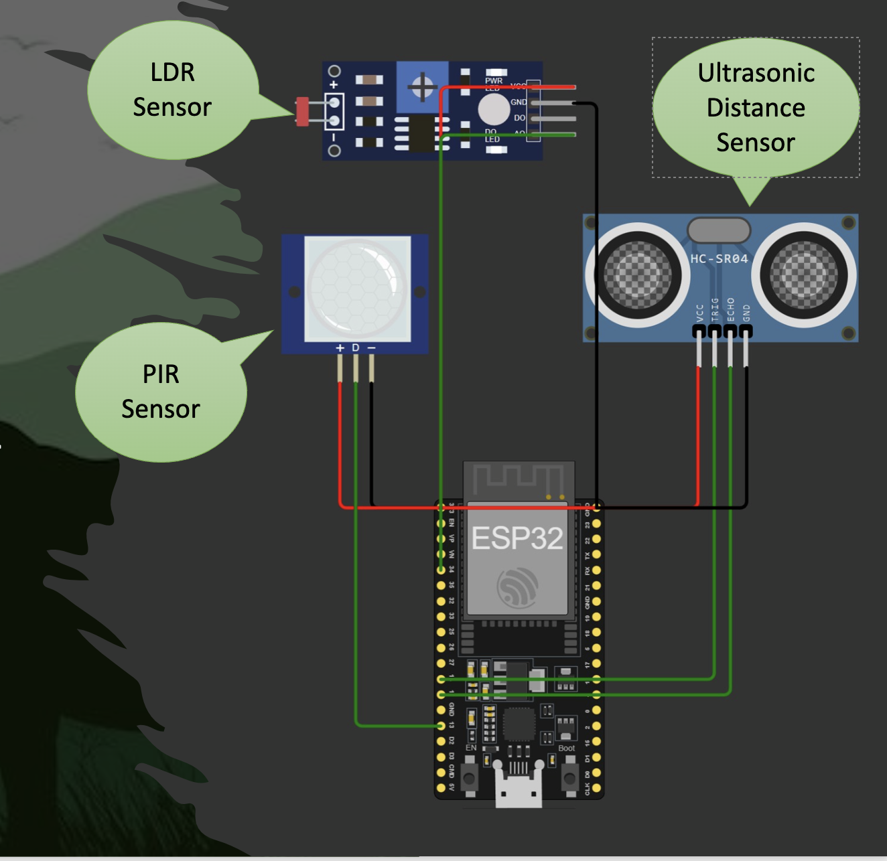

# 🦉 Smart Wildlife Monitoring System  

## 📖 Overview  
The **Smart Wildlife Monitoring System** is an IoT-based solution designed to monitor animal activity using an ESP32 microcontroller and multiple sensors (PIR, ultrasonic, LDR). It intelligently detects motion, estimates animal size, determines activity periods (day/night), and uploads the data to **ThingSpeak** for visualization and analysis.  

This system helps researchers and conservationists track wildlife patterns, prevent poaching, and study animal behavior with minimal human interference.  

---

## ✨ Features  
- 🕵️ **Motion Detection** using a PIR sensor  
- 📏 **Distance Measurement** with an ultrasonic sensor  
- 💡 **Light Level Analysis** using an LDR for day/night detection  
- 🐾 **Animal Identification** (large, medium, small) with time-of-day activity classification  
- 📤 **Cloud Integration** – sends data to ThingSpeak for visualization  
- 🚨 **False Positive Filtering** using sensor fusion (distance + light)  
- 📸 **Simulated Camera Trigger** for proof-of-concept image capture  

---

## 🏗️ Hardware Setup  

| Component          | ESP32 Pin | Description |
|--------------------|-----------|-------------|
| PIR Sensor (OUT)   | GPIO 13   | Detects motion |
| Ultrasonic Trigger | GPIO 14   | Sends sound pulses |
| Ultrasonic Echo    | GPIO 12   | Receives reflected pulses |
| LDR Sensor (ADC)   | GPIO 34   | Reads light level |

---

## 🚀 Getting Started  

### 1. Clone the Repository  
```bash
git clone https://github.com/lilswapnil/Smart-Wildlife-Monitoring-System.git
cd Smart-Wildlife-Monitoring-System
````

### 2. Flash MicroPython to ESP32

Make sure your ESP32 has MicroPython installed:

```bash
esptool.py --chip esp32 erase_flash
esptool.py --chip esp32 write_flash -z 0x1000 esp32-idf4-20230426-v1.20.0.bin
```

### 3. Install Requirements (on your computer)

```bash
pip install -r requirements.txt
```

### 4. Upload Code to ESP32

```bash
mpremote connect /dev/ttyUSB0 cp main.py :
mpremote connect /dev/ttyUSB0 run main.py
```

---

## ⚙️ Configuration

Create a `secrets.py` file in your project directory (do **not** commit it to GitHub):

```python
# secrets.py
THINGSPEAK_WRITE_KEY = "YOUR_API_KEY"
SSID = "YOUR_WIFI_SSID"
PASSWORD = "YOUR_WIFI_PASSWORD"
```

Update `main.py` to import these values:

```python
from secrets import THINGSPEAK_WRITE_KEY, SSID, PASSWORD
```

---

## 📊 Data Sent to ThingSpeak

* **Field1:** Motion detected (0/1)
* **Field2:** Distance (cm)
* **Field3:** Light level (0–4095)
* **Field4:** False positive flag (0 = real, 1 = false)
* **Field5:** Animal type (coded integer)

---

## 📂 Project Structure

```
Smart-Wildlife-Monitoring-System/
│── main.py              # Main firmware for ESP32
│── requirements.txt     # Host-side tools
│── secrets.py           # WiFi + API key (ignored in git)
│── README.md            # Documentation
```

---

##🖼️ System Architecture 

<p align="center">
  
  <br/>
  <em>High-level flow of the ESP32-based Smart Wildlife Monitoring System.</em>
</p>


---

## 🔮 Future Enhancements

* Add **real camera support** (ESP32-CAM)
* Deploy **ML models** for species recognition
* Integrate with **mobile app/dashboard** for live alerts
* Support **LoRaWAN/Edge AI** for remote monitoring

---

## 🤝 Contributing

Pull requests are welcome. For major changes, please open an issue first to discuss what you’d like to change.

---

## 📜 License

This project is licensed under the **MIT License**

---

## 👨‍💻 Author

**Swapnil Bhalerao**
🔗 [GitHub Profile](https://github.com/lilswapnil)